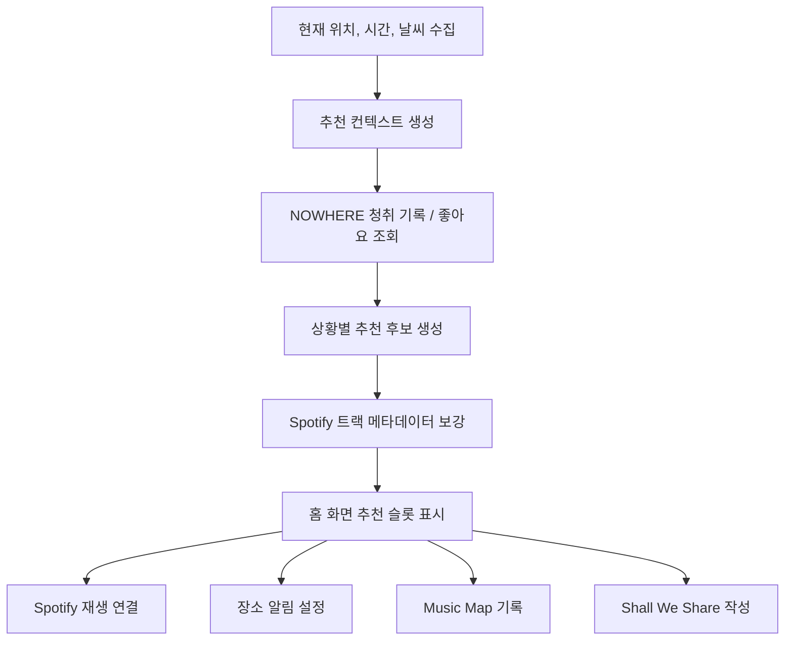
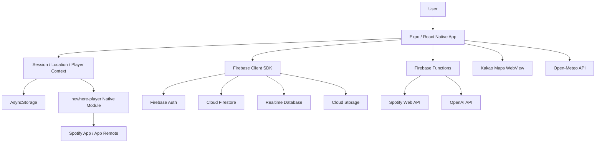

# NOWHERE

> 사용자가 머무는 장소, 시간, 날씨, 청취 기록을 연결해 음악 경험을 공간의 기억으로 확장하는 모바일 서비스

NOWHERE는 단순한 음악 플레이어가 아니라, 사용자가 있는 공간에 음악적 요소를 더하는 것에 주목하는 React Native 기반 앱입니다.  
사용자가 음악을 통해 장소를 떠올리고, 그 장소에서 또다시 음악을 떠올릴 수 있도록 설계했습니다.

## 목차

- [프로젝트 개요](#프로젝트-개요)
- [주요 기능](#주요-기능)
- [서비스 흐름](#서비스-흐름)
- [기술 스택](#기술-스택)
- [아키텍처](#아키텍처)
- [실행 방법](#실행-방법)
- [환경 변수](#환경-변수)
- [외부 서비스 및 저작권](#외부-서비스-및-저작권)

## 프로젝트 개요

| 항목 | 내용 |
| --- | --- |
| 프로젝트명 | NOWHERE |
| 플랫폼 | iOS / Android |
| 형태 | React Native 모바일 앱, Firebase 서버리스 백엔드, Firebase Hosting 보조 웹 페이지 |
| 핵심 가치 | 음악을 장소, 시간, 날씨, 이동 경로와 연결해 개인적인 음악 경험을 기록하고 추천 |
| 주요 기능 | 공간에 맞는 음악 추천, Challenge, 장소 알림,
 Music Map, Shall We Share|
| 주요 연동 | Spotify, Firebase, OpenAI API, Kakao Maps, Open-Meteo |

## 주요 기능

### 1. 위치 기반 음악 추천

홈 화면의 중앙 원에는 사용자의 위치 / 현재 날씨 / 시간대에 따라 듣기 좋은 음악을 추천해줍니다.   
원을 탭하면 Spotify로 넘어가여 노래가 재생됩니다.  

추천 탭은 다음 맥락을 기준으로 구성됩니다.
- 요즘 자주 듣는 곡
- 현재 시간대에 어울리는 곡
- 현재 장소에 어울리는 곡
- 현재 날씨에 어울리는 곡
- 사용자가 장르, 국가, 분위기를 조합해 새로운 곡을 추천받는 Challenge

추천 로직은 NOWHERE 내부 청취 기록과 좋아요 데이터를 우선 활용하고, 데이터가 부족한 초기 상태에서는 상황별 후보와 트렌드 기반 fallback을 사용합니다. 
사용자가 앱을 더 많이 사용할수록 특정 시간, 장소, 날씨에서 선호한 음악이 다시 추천될 수 있도록 설계했습니다.

### 2. 장소 알림

사용자는 지도에서 원하는 장소를 선택하고 반경을 설정한 뒤, 해당 장소에서 듣고 싶은 Spotify 트랙 또는 플레이리스트를 연결할 수 있습니다.

지원 반경:

- 50m
- 100m
- 200m
- 300m

앱은 foreground/background 위치 권한과 저장된 장소 정보를 바탕으로 장소 진입 여부를 판단합니다.   
사용자가 지정한 장소에 도착 시 알림을 띄우고 사용자가 알림을 통해 음악 재생으로 이동하는 흐름을 중심으로 구현했습니다.

### 3. Music Map

Music Map은 사용자가 이동하며 들은 음악을 지도 위에 기록하는 기능입니다. 이동 경로, 재생 곡, 앨범아트, 앨범 대표 색상을 함께 저장해 나중에 "어디서 어떤 음악을 들었는지" 다시 확인할 수 있습니다.

기록 모드는 Spotify API 정책과 심사 환경을 고려해 두 가지 흐름으로 나뉩니다.

| 모드 | 설명 |
| --- | --- |
| 일반 모드 | Spotify 현재 재생곡 정보를 가져와 실제 청취 흐름과 이동 경로를 함께 기록 |
| 데모 모드 | 사용자가 선택한 플레이리스트의 곡 길이와 순서를 바탕으로 Music Map 경험을 체험 |

Music Map 기록은 캡처하기 기능을 통해 Music Receipt로 이어집니다. 기록 날짜, 이동 거리, 기록 시간, 경로, 포함된 곡 수, 다이어리 문구를 영수증 형태로 정리해 저장할 수 있습니다.

### 4. Shall We Share

Shall We Share는 사용자가 현재 위치에 하루 한 번 음악 한 곡과 짧은 문장을 남길 수 있는 기능입니다.   
개인 기록 중심의 Music Map과 달리, 같은 공간에 있었던 다른 사용자의 음악과 감정을 발견하는 공유형태의 경험을 제공합니다.

주요 설계:
- 하루 한 번 작성 제한
- 현재 위치 기반 주변 기록 조회
- 노래, 한마디, 위치 정보를 함께 저장
- 장소에 기반한 노래 추천을 받도록 함

### 5. Spotify 연동

NOWHERE는 음악 파일을 직접 저장하거나 배포하지 않습니다. Spotify URI와 메타데이터를 사용하고, 실제 재생은 Spotify 앱 또는 Spotify API 흐름으로 연결합니다.

연동 범위:
- Spotify 트랙 검색
- Spotify 플레이리스트 조회
- Spotify URI 기반 재생 연결
- 현재 재생 상태 연동
- iOS/Android native bridge를 통한 Spotify App Remote 연결

## 서비스 흐름

## 기술 스택

### Client

| 영역 | 기술 |
| --- | --- |
| Framework | Expo, React Native, React |
| Navigation | React Navigation Native Stack / Bottom Tabs |
| State / Cache | React Context, AsyncStorage |
| Location | expo-location, expo-task-manager |
| Map | react-native-maps, Kakao Maps WebView |
| Native Bridge | Expo Modules 기반 `nowhere-player` |
| Media / Share | expo-media-library, expo-sharing, react-native-view-shot |
| UI | React Native StyleSheet, @expo/vector-icons |

### Backend / Infra

| 영역 | 기술 |
| --- | --- |
| Auth / Data | Firebase Authentication, Firestore, Realtime Database, Storage |
| Serverless | Firebase Functions v2, Node.js |
| Hosting | Firebase Hosting |
| Security | Firebase Security Rules, Functions secrets |
| Build | EAS Build, Expo prebuild, Gradle |

### External APIs

| API | 사용 목적 |
| --- | --- |
| Spotify Web API / App Remote | 트랙 검색, 플레이리스트 조회, 재생 연결, 현재 재생 상태 연동 |
| OpenAI API | Challenge 추천 및 추천 문구 생성 |
| Kakao Maps JavaScript API | 장소 선택, 지도 렌더링, 음악 기록 위치 표시 |
| Open-Meteo Forecast API | 현재 위치 기반 날씨 정보 조회 |

## 아키텍처

## License

개인 포트폴리오 및 경진대회 제출 목적의 프로젝트입니다. 외부 API 키와 Firebase secrets는 저장소에 포함하지 않습니다.
