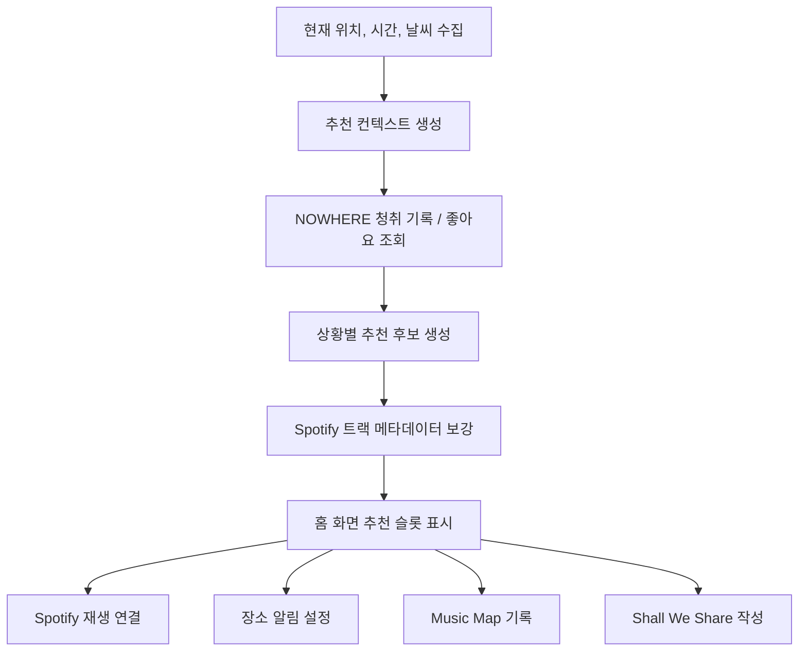
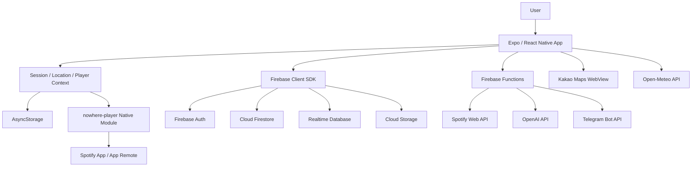

# NOWHERE

> 사용자가 머무는 장소, 시간, 날씨, 청취 기록을 연결해 음악 경험을 공간의 기억으로 확장하는 모바일 서비스입니다.

NOWHERE는 단순한 음악 플레이어가 아니라, Spotify 재생 환경 위에 위치 기반 추천, 장소 알림, 뮤직지도, 익명 음악 공유 기능을 더한 React Native 기반 앱입니다. 사용자가 어떤 장소에서 어떤 음악을 들었는지 기록하고, 비슷한 순간에 다시 떠올릴 수 있도록 설계했습니다.

## 목차

- [프로젝트 개요](#프로젝트-개요)
- [주요 기능](#주요-기능)
- [서비스 흐름](#서비스-흐름)
- [기술 스택](#기술-스택)
- [아키텍처](#아키텍처)
- [구현 포인트](#구현-포인트)
- [UX 설계](#ux-설계)
- [프로젝트 구조](#프로젝트-구조)
- [실행 방법](#실행-방법)
- [환경 변수](#환경-변수)
- [외부 서비스 및 저작권](#외부-서비스-및-저작권)

## 프로젝트 개요

| 항목 | 내용 |
| --- | --- |
| 프로젝트명 | NOWHERE |
| 플랫폼 | iOS / Android |
| 형태 | React Native 모바일 앱, Firebase 서버리스 백엔드, Firebase Hosting 보조 웹 페이지 |
| 핵심 가치 | 음악을 장소, 시간, 날씨, 이동 경로와 연결해 개인적인 음악 경험을 기록하고 추천 |
| 주요 기능 | 위치 기반 음악 추천, 장소 알림, Music Map, Shall We Share, Music Receipt |
| 주요 연동 | Spotify, Firebase, OpenAI API, Kakao Maps, Open-Meteo |

## 주요 기능

### 1. 위치 기반 음악 추천

홈 화면의 중앙 원을 탭하면 현재 맥락에 맞는 음악을 추천받고 Spotify로 재생을 연결할 수 있습니다.

추천 탭은 다음 맥락을 기준으로 구성됩니다.

- 요즘 자주 듣는 곡
- 현재 시간대에 어울리는 곡
- 현재 장소에 어울리는 곡
- 현재 날씨에 어울리는 곡
- 사용자가 장르, 국가, 분위기를 조합해 새로운 곡을 추천받는 Challenge

추천 로직은 NOWHERE 내부 청취 기록과 좋아요 데이터를 우선 활용하고, 데이터가 부족한 초기 상태에서는 상황별 후보와 트렌드 기반 fallback을 사용합니다. 사용자가 앱을 더 많이 사용할수록 특정 시간, 장소, 날씨에서 선호한 음악이 다시 추천될 수 있도록 설계했습니다.

관련 코드:

- `src/screens/HomeScreen.js`
- `src/screens/RecommendScreen.js`
- `src/services/recommendationService.js`
- `src/services/listeningHistoryService.js`
- `functions/index.js`

### 2. 장소 알림

사용자는 지도에서 원하는 장소를 선택하고 반경을 설정한 뒤, 해당 장소에서 듣고 싶은 Spotify 트랙 또는 플레이리스트를 연결할 수 있습니다.

지원 반경:

- 50m
- 100m
- 200m
- 300m

앱은 foreground/background 위치 권한과 저장된 장소 정보를 바탕으로 장소 진입 여부를 판단합니다. 플랫폼 정책과 사용자 동의 문제를 고려해 백그라운드에서 임의로 음악을 자동 재생하는 대신, 장소 도착 시 알림을 띄우고 사용자가 알림을 통해 음악 재생으로 이동하는 흐름을 중심으로 구현했습니다.

관련 코드:

- `src/screens/PlaceSetupScreen.js`
- `src/contexts/LocationContext.js`
- `src/services/autoPlayService.js`
- `src/services/autoPlayNotificationService.js`

### 3. Music Map

Music Map은 사용자가 이동하며 들은 음악을 지도 위에 기록하는 기능입니다. 이동 경로, 재생 곡, 앨범아트, 앨범 대표 색상을 함께 저장해 나중에 "어디서 어떤 음악을 들었는지" 다시 확인할 수 있습니다.

기록 모드는 Spotify API 정책과 심사 환경을 고려해 두 가지 흐름으로 나뉩니다.

| 모드 | 설명 |
| --- | --- |
| 일반 모드 | Spotify 현재 재생곡 정보를 가져와 실제 청취 흐름과 이동 경로를 함께 기록 |
| 데모 모드 | 사용자가 선택한 플레이리스트의 곡 길이와 순서를 바탕으로 Music Map 경험을 체험 |

Music Map 기록은 캡처하기 기능을 통해 Music Receipt로 이어집니다. 기록 날짜, 이동 거리, 기록 시간, 경로, 포함된 곡 수, 다이어리 문구를 영수증 형태로 정리해 저장할 수 있습니다.

관련 코드:

- `src/screens/MusicMapScreen.js`
- `src/screens/MusicDiaryScreen.js`
- `src/services/musicMapRecordingService.js`
- `src/services/musicMapPlaylistService.js`
- `src/services/musicMapNotificationService.js`
- `src/services/musicDiaryDraftService.js`

### 4. Shall We Share

Shall We Share는 사용자가 현재 위치에 하루 한 번 음악 한 곡과 짧은 문장을 남길 수 있는 기능입니다. 개인 기록 중심의 Music Map과 달리, 같은 공간에 있었던 다른 사용자의 음악과 감정을 발견하는 공유형 경험을 제공합니다.

주요 설계:

- 하루 한 번 작성 제한
- 현재 위치 기반 주변 기록 조회
- 노래, 한마디, 위치 정보를 함께 저장
- 사용자 식별보다 장소와 분위기 중심의 경험을 우선

관련 코드:

- `src/screens/VibeScreen.js`
- `src/services/firebaseService.js`
- `src/services/firebaseValidation.js`
- `database.rules.json`

### 5. Spotify 연동

NOWHERE는 음악 파일을 직접 저장하거나 배포하지 않습니다. Spotify URI와 메타데이터를 사용하고, 실제 재생은 Spotify 앱 또는 Spotify API 흐름으로 연결합니다.

연동 범위:

- Spotify 트랙 검색
- Spotify 플레이리스트 조회
- Spotify URI 기반 재생 연결
- 현재 재생 상태 연동
- iOS/Android native bridge를 통한 Spotify App Remote 연결

관련 코드:

- `modules/nowhere-player/ios/NowherePlayerModule.swift`
- `modules/nowhere-player/android/src/main/java/com/nowhere/player/NowherePlayerModule.kt`
- `src/services/musicPlayerService.js`
- `src/services/ownerSpotifyService.js`

## 서비스 흐름



## 기술 스택

### Client

| 영역 | 기술 |
| --- | --- |
| Framework | Expo, React Native, React |
| Navigation | React Navigation Native Stack / Bottom Tabs |
| State / Cache | React Context, AsyncStorage |
| Location | expo-location, expo-task-manager |
| Map | react-native-maps, Kakao Maps WebView |
| Native Bridge | Expo Modules 기반 `nowhere-player` |
| Media / Share | expo-media-library, expo-sharing, react-native-view-shot |
| UI | React Native StyleSheet, @expo/vector-icons |

### Backend / Infra

| 영역 | 기술 |
| --- | --- |
| Auth / Data | Firebase Authentication, Firestore, Realtime Database, Storage |
| Serverless | Firebase Functions v2, Node.js |
| Hosting | Firebase Hosting |
| Security | Firebase Security Rules, Functions secrets |
| Build | EAS Build, Expo prebuild, Gradle |

### External APIs

| API | 사용 목적 |
| --- | --- |
| Spotify Web API / App Remote | 트랙 검색, 플레이리스트 조회, 재생 연결, 현재 재생 상태 연동 |
| OpenAI API | Challenge 추천 및 추천 문구 생성 |
| Kakao Maps JavaScript API | 장소 선택, 지도 렌더링, 음악 기록 위치 표시 |
| Open-Meteo Forecast API | 현재 위치 기반 날씨 정보 조회 |
| Telegram Bot API | Spotify 심사용 계정 등록 요청 알림 |

## 아키텍처



## 구현 포인트

### 위치 처리 분리

NOWHERE는 현재 위치 표시, 날씨 조회, 장소 알림, Music Map 기록을 모두 다루기 때문에 위치 관련 책임을 분리했습니다.

| 흐름 | 역할 |
| --- | --- |
| foreground location | 현재 위치, 장소명, 날씨 갱신 |
| background location | 저장 장소 진입 감지 |
| geofence candidate | 저장 장소 반경 비교 및 쿨다운 판단 |
| music map recording | 이동 경로와 재생 곡 매칭 |

### 추천 로직

추천은 단순한 인기곡 나열이 아니라 사용자의 맥락과 앱 내부 행동 데이터를 함께 사용합니다.

1. 위치, 시간, 날씨 정보를 수집합니다.
2. 사용자의 좋아요와 청취 기록을 조회합니다.
3. 같은 장소, 시간대, 날씨에서 선호한 곡을 우선 추천합니다.
4. 데이터가 부족하면 상황별 후보와 트렌드 기반 fallback을 사용합니다.
5. Challenge 요청은 OpenAI API로 후보를 생성하고 Spotify 검색 결과로 보강합니다.

### Spotify 정책 대응

Spotify API는 개발 모드와 계정 권한에 따라 사용할 수 있는 범위가 달라질 수 있습니다. NOWHERE는 이 제약을 고려해 다음 구조를 사용했습니다.

- 실제 음원 파일은 저장하거나 배포하지 않고 Spotify URI로 연결
- 심사 및 데모 환경을 위한 별도 fallback 흐름 제공
- Music Map 일반 모드와 데모 모드 분리
- 플랫폼별 인증/재생 흐름을 native module에서 처리

### 데이터 검증과 보안 규칙

사용자가 남기는 장소, 공유 기록, 음악 기록은 Firebase 계층에서 검증합니다. 클라이언트 입력은 `firebaseValidation.js`에서 정리하고, Firestore / Realtime Database / Storage Rules를 통해 사용자별 접근 범위를 제한합니다.

관련 코드:

- `src/services/firebaseValidation.js`
- `firestore.rules`
- `database.rules.json`
- `storage.rules`

## UX 설계

NOWHERE의 화면은 "공간에 음악이 남는 경험"을 전달하는 방향으로 설계했습니다.

- 어두운 배경과 복숭아색 포인트 컬러를 사용해 밤 산책, 이동, 음악 감상의 분위기를 반영했습니다.
- 홈 화면 중앙의 큰 원을 핵심 인터랙션으로 두어 현재 맥락에 맞는 추천을 직관적으로 실행할 수 있게 했습니다.
- 위치, 시간, 날씨 정보를 칩 형태로 표시해 앱이 현재 상황을 인식하고 있다는 느낌을 제공합니다.
- 장소 알림 설정은 "장소 선택 -> 장소 이름/반경 설정 -> 음악 선택" 순서로 구성해 처음 사용하는 사용자도 흐름을 따라갈 수 있게 했습니다.
- Music Map은 일반 모드와 데모 모드를 명확히 분리하고, 기록 후 Music Receipt로 이어지도록 설계했습니다.
- SpotlightGuide를 통해 홈, 장소 알림, Music Map, Shall We Share의 핵심 사용법을 단계적으로 안내합니다.

## Screenshots

| Home | Music Map | Share |
| --- | --- | --- |
|  |  |  |

## 프로젝트 구조

```text
NOWHERE
├── src
│   ├── components          # 재사용 UI, SpotlightGuide, 지도 컴포넌트
│   ├── contexts            # Session, Location, Player 전역 상태
│   ├── hooks               # SpotlightGuide 등 화면 공통 hook
│   ├── navigation          # 앱 진입, 온보딩, 메인 스택
│   ├── screens             # 주요 화면
│   ├── services            # Firebase, Spotify, 추천, 위치, 기록 도메인 로직
│   └── constants           # 색상, 환경 변수 기반 설정, 옵션 상수
├── assets                  # 앱 아이콘, 인앱 이미지, 영수증 배경 등 런타임 자산
├── docs
│   └── screenshots         # README 및 문서용 UI 이미지
├── modules/nowhere-player  # Expo Native Module, Spotify App Remote bridge
├── functions               # Firebase Functions
├── hosting                 # Kakao Maps WebView용 HTML
├── android                 # Expo prebuild Android project
├── ios                     # Expo prebuild iOS project
├── firestore.rules
├── database.rules.json
├── storage.rules
├── firebase.json
└── app.json
```

## 실행 방법

### 1. 의존성 설치

```bash
npm install
```

### 2. Expo 개발 서버 실행

```bash
npm run start
```

### 3. Android 실행

```bash
npm run android
```

### 4. iOS 실행

```bash
npm run ios
```

### 5. Firebase Functions 로컬 실행

```bash
cd functions
npm install
npm run serve
```

### 6. Android release APK 빌드

```bash
cd android
JAVA_HOME=/opt/homebrew/opt/openjdk@17/libexec/openjdk.jdk/Contents/Home \
ANDROID_HOME=/opt/homebrew/share/android-commandlinetools \
./gradlew :app:assembleRelease
```

빌드 결과:

```text
android/app/build/outputs/apk/release/app-release.apk
```

## 환경 변수

실제 값은 `.env.local`에만 저장하고 저장소에는 포함하지 않습니다. `.env.example`에는 필요한 변수 이름만 제공합니다.

```bash
EXPO_PUBLIC_FIREBASE_API_KEY=
EXPO_PUBLIC_FIREBASE_APP_ID=
EXPO_PUBLIC_FIREBASE_AUTH_DOMAIN=
EXPO_PUBLIC_FIREBASE_DATABASE_URL=
EXPO_PUBLIC_FIREBASE_FUNCTIONS_REGION=asia-northeast3
EXPO_PUBLIC_FIREBASE_MESSAGING_SENDER_ID=
EXPO_PUBLIC_FIREBASE_PROJECT_ID=
EXPO_PUBLIC_FIREBASE_STORAGE_BUCKET=
EXPO_PUBLIC_KAKAO_MAPS_API_KEY=
EXPO_PUBLIC_KAKAO_MAPS_BASE_URL=
EXPO_PUBLIC_SPOTIFY_CLIENT_ID=
EXPO_PUBLIC_SPOTIFY_REDIRECT_URI=
EXPO_PUBLIC_USE_FIREBASE_EMULATORS=false
```

Firebase Functions secrets:

```bash
firebase functions:secrets:set OPENAI_API_KEY
firebase functions:secrets:set TELEGRAM_BOT_TOKEN
firebase functions:secrets:set TELEGRAM_CHAT_ID
firebase functions:secrets:set SPOTIFY_OWNER_CLIENT_ID
firebase functions:secrets:set SPOTIFY_OWNER_CLIENT_SECRET
firebase functions:secrets:set SPOTIFY_OWNER_REFRESH_TOKEN
```

## 외부 서비스 및 저작권

NOWHERE는 음악 음원 파일을 직접 저장하거나 배포하지 않습니다. Spotify API 응답의 곡명, 아티스트명, 앨범아트, URI 등 메타데이터를 사용하고 실제 재생은 Spotify 앱 또는 Spotify 연동 흐름으로 연결합니다.

| 구분 | 사용 항목 | 비고 |
| --- | --- | --- |
| 앱 프레임워크 | React Native, Expo | MIT 계열 오픈소스 |
| 네비게이션 | React Navigation | MIT |
| 위치/작업 | expo-location, expo-task-manager | MIT |
| 지도 | Kakao Maps JavaScript API, react-native-maps | Kakao Developers 약관 및 라이브러리 라이선스 준수 |
| 백엔드 | Firebase, firebase-admin, firebase-functions | Firebase 및 각 패키지 라이선스 준수 |
| 음악 | Spotify Web API, Spotify App Remote SDK | Spotify Developer Terms 준수 |
| 날씨 | Open-Meteo Forecast API | Open-Meteo 이용 조건 준수 |
| AI 추천 | OpenAI API | Challenge 추천 및 문구 생성에 사용 |
| 앱 그래픽 | AppLogo, EmptyMark, ChallengeMark, ChallengeOrb, receipt 이미지 | 프로젝트 내부 제작/수정 자산 |

## License

개인 포트폴리오 및 경진대회 제출 목적의 프로젝트입니다. 외부 API 키와 Firebase secrets는 저장소에 포함하지 않습니다.
