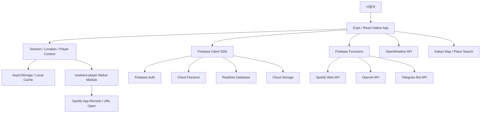

# NOWHERE

> 위치, 날씨, 시간, 취향을 기반으로 사용자의 현재 맥락에 맞는 음악을 추천하고, 장소와 이동 경로 위에 음악 경험을 기록하는 React Native 기반 모바일 앱입니다.

NOWHERE는 "어디에 있느냐"와 "무엇을 듣고 있느냐"를 하나의 경험으로 연결하는 음악 라이프로그 서비스입니다. 사용자는 현재 위치와 날씨에 맞는 음악을 추천받고, 자주 가는 장소에 Spotify 재생 대상을 연결해 자동 재생을 준비하며, 산책이나 이동 중 들은 음악을 지도 위에 기록할 수 있습니다.

## 목차

- [프로젝트 개요](#프로젝트-개요)
- [핵심 기능](#핵심-기능)
- [기술 스택](#기술-스택)
- [아키텍처](#아키텍처)
- [주요 구현 내용](#주요-구현-내용)
- [트러블슈팅](#트러블슈팅)
- [프로젝트 구조](#프로젝트-구조)
- [실행 방법](#실행-방법)
- [환경 변수](#환경-변수)
- [포트폴리오 관점 정리](#포트폴리오-관점-정리)

## 프로젝트 개요

| 항목 | 내용 |
| --- | --- |
| 프로젝트명 | NOWHERE |
| 형태 | iOS / Android 모바일 앱, Firebase 백엔드, Firebase Hosting 보조 웹 페이지 |
| 개발 목적 | 위치 기반 음악 추천, 자동 재생, 음악 지도, 음악 다이어리 기능을 갖춘 개인 포트폴리오 앱 |
| 주요 사용자 경험 | 현재 위치 기반 추천, 저장 장소 자동 재생, 이동 경로 음악 기록, 주변 사용자 음악 분위기 확인 |
| 핵심 외부 API | Spotify Web API / App Remote, Firebase, OpenAI API, Kakao 지도, OpenWeather |
| 현재 상태 | Android Spotify 인증 이슈 대응을 위해 인증 실패 시에도 메인 화면 진입 및 Spotify 앱 열기 fallback 제공 |

## 핵심 기능

### 1. 위치 기반 음악 추천

- Expo Location으로 현재 위치와 권한 상태를 관리합니다.
- 위치, 날씨, 시간대, 선호 아티스트, 최근 청취 맥락을 조합해 추천 요청을 구성합니다.
- Firebase Functions에서 OpenAI API를 호출해 추천 슬롯을 생성하고, Spotify Owner API로 실제 재생 가능한 트랙 정보를 보강합니다.

관련 코드:

- `src/contexts/LocationContext.js`
- `src/services/recommendationService.js`
- `src/services/weatherService.js`
- `functions/index.js`

### 2. Spotify 연동 및 재생 fallback

- iOS는 native Spotify App Remote 흐름을 중심으로 동작합니다.
- Android는 Spotify 인증 callback 안정성 문제를 보완하기 위해 Authorization Code + PKCE 흐름과 별도 callback Activity를 구성했습니다.
- Android에서는 인증 실패가 앱 진입을 막지 않도록 기본 탐색 모드를 제공하고, 재생은 Spotify 앱 또는 URL 열기 fallback을 우선 사용합니다.

관련 코드:

- `modules/nowhere-player/ios/NowherePlayerModule.swift`
- `modules/nowhere-player/android/src/main/java/com/nowhere/player/NowherePlayerModule.kt`
- `android/app/src/main/java/com/nowhere/nowhere/SpotifyAuthCallbackActivity.kt`
- `src/services/musicPlayerService.js`
- `src/screens/SpotifyPermissionScreen.js`

### 3. 장소 저장 및 자동 재생

- 사용자가 장소를 저장하고 반경을 설정할 수 있습니다.
- 저장된 장소에는 Spotify 트랙 또는 플레이리스트 재생 대상을 연결할 수 있습니다.
- 앱은 foreground/background 위치 권한과 geofence를 활용해 장소 도착을 감지하고 자동 재생 준비 또는 알림을 처리합니다.

관련 코드:

- `src/screens/PlaceSetupScreen.js`
- `src/contexts/LocationContext.js`
- `src/services/autoPlayService.js`
- `src/services/autoPlayNotificationService.js`

### 4. Music Map

- 이동 경로와 청취 음악을 하나의 세션으로 기록합니다.
- GPS 노이즈를 줄이기 위해 정확도, 속도, 점프 거리, 최대 포인트 수 등을 제한합니다.
- 기록된 경로는 지도 UI에서 다시 확인할 수 있고, Spotify 플레이리스트 생성 흐름과 연결됩니다.

관련 코드:

- `src/screens/MusicMapScreen.js`
- `src/services/musicMapRecordingService.js`
- `src/services/musicMapPlaylistService.js`
- `src/services/musicMapNotificationService.js`

### 5. Vibe

- 사용자의 현재 위치 geohash를 기준으로 주변 사용자들의 음악 분위기를 공유합니다.
- Firebase Realtime Database rules를 통해 인증된 사용자만 읽고 쓸 수 있도록 제한합니다.

관련 코드:

- `src/screens/VibeScreen.js`
- `src/services/locationService.js`
- `database.rules.json`

### 6. Music Diary

- 음악 감상 경험을 카드 형태로 기록합니다.
- 앨범 아트, 대표 색상, 텍스트를 조합해 개인 음악 다이어리로 저장할 수 있습니다.

관련 코드:

- `src/screens/MusicDiaryScreen.js`
- `src/services/musicDiaryDraftService.js`
- `src/services/albumColorService.js`
- `src/services/albumArtworkService.js`

### 7. Firebase 기반 사용자/데이터 관리

- Firebase Auth 세션을 `SessionContext`에서 관리합니다.
- Firestore에는 저장 장소, 재생 기록, 선호 아티스트, Spotify 등록 요청, Music Map 기록 등을 저장합니다.
- Firestore Rules와 Storage Rules를 통해 사용자별 접근 권한과 데이터 스키마를 제한합니다.

관련 코드:

- `src/contexts/SessionContext.js`
- `src/services/firebaseService.js`
- `firestore.rules`
- `storage.rules`

## 기술 스택

### Client

| 분류 | 기술 |
| --- | --- |
| Framework | Expo 55, React Native 0.83, React 19 |
| Navigation | React Navigation Native Stack / Bottom Tabs |
| State | React Context, AsyncStorage |
| Location | expo-location, expo-task-manager |
| Map | react-native-maps, Kakao 지도 WebView |
| Native Module | Expo Modules 기반 `nowhere-player` |
| Media | expo-media-library, react-native-view-shot |
| UI | React Native StyleSheet, Ionicons / Expo Vector Icons |

### Backend / Infra

| 분류 | 기술 |
| --- | --- |
| BaaS | Firebase Auth, Firestore, Realtime Database, Storage |
| Serverless | Firebase Functions v2, Node.js 22 |
| Hosting | Firebase Hosting |
| Deployment | EAS Build, Firebase CLI |
| Security | Firebase Security Rules, Functions secrets |

### External APIs

| API | 사용 목적 |
| --- | --- |
| Spotify Web API | 트랙 검색, 아티스트 검색, 플레이리스트 조회/생성, 추천 후보 보강 |
| Spotify App Remote | iOS/Android 앱 재생 제어 및 현재 재생 상태 수신 |
| OpenAI API | 현재 맥락 기반 음악 추천 생성 |
| OpenWeather | 현재 위치 날씨 기반 추천 맥락 생성 |
| Kakao Map | 장소 검색 및 지도 UI |
| Telegram Bot API | Spotify 심사용 계정 등록 요청 알림 |

## 아키텍처



## 주요 구현 내용

### 위치 권한과 background task 분리

NOWHERE는 단순히 현재 위치만 읽는 앱이 아니라, 저장 장소 도착 감지와 Music Map 기록을 함께 처리합니다. 그래서 위치 처리를 다음처럼 분리했습니다.

| 흐름 | 역할 |
| --- | --- |
| foreground location | 현재 위치, 날씨, 장소명 갱신 |
| background location | 자동 재생 장소 감지 |
| geofence | 저장 장소 반경 진입 감지 |
| music map recording | 이동 경로 기록과 Spotify 재생 상태 매칭 |

### Spotify Owner API 설계

Spotify Development Mode에서는 사용자별 API 접근 제약이 있기 때문에, 데모와 포트폴리오 시나리오에서는 Owner Token을 이용해 공개 트랙/플레이리스트 정보를 조회하는 서버 함수를 별도로 구성했습니다.

대표 Functions:

- `getDemoSpotifyTracks`
- `searchSpotifyTracks`
- `searchSpotifyArtists`
- `getSpotifyPlaylistTracks`
- `createOwnerMusicMapPlaylist`
- `getFavoriteArtistHitTracks`

### 추천 로직 이중화

추천 품질과 안정성을 모두 확보하기 위해 다음 흐름을 구성했습니다.

1. 사용자 위치, 날씨, 시간, 취향 정보를 수집합니다.
2. Firebase Functions에서 OpenAI API로 추천 후보를 생성합니다.
3. Spotify API로 실제 재생 가능한 트랙 정보를 조회합니다.
4. 추천 실패 시 owner playlist 또는 demo track fallback을 제공합니다.

### Android Spotify 인증 fallback

Android Spotify 인증은 iOS보다 Activity lifecycle, browser redirect, Spotify 앱 설치 상태, custom scheme 처리의 영향을 크게 받습니다. 이 프로젝트에서는 다음 방식으로 안정성을 보강했습니다.

- Authorization Code + PKCE 기반 token exchange
- 전용 `SpotifyAuthCallbackActivity`로 redirect URL 수신
- 인증 실패 시에도 앱 구조 확인이 가능하도록 메인 화면 진입 허용
- Android 재생은 Spotify 앱/URL 열기 fallback 우선 사용

## 트러블슈팅

### 1. Android Spotify 인증 callback 유실

문제:

- Spotify 동의 화면에서 앱으로 돌아오지만 `SpotifyPermissionScreen`이 무한 로딩에 빠졌습니다.
- Expo Linking 또는 MainActivity `onNewIntent`가 callback을 안정적으로 전달하지 못하는 케이스가 있었습니다.

해결:

- Spotify redirect를 직접 받는 `SpotifyAuthCallbackActivity`를 추가했습니다.
- callback URL을 SharedPreferences에 저장하고 native module이 pending callback을 읽어 token exchange를 시도하도록 구성했습니다.
- 인증 실패 시 앱 진입을 막지 않도록 Android 기본 탐색 모드를 추가했습니다.

### 2. Spotify Android Auth SDK `AUTHENTICATION_SERVICE_UNAVAILABLE`

문제:

- Spotify Android Auth SDK의 `openLoginActivity`를 사용했을 때 일부 Android 환경에서 동의 화면으로 넘어가지 않고 `AUTHENTICATION_SERVICE_UNAVAILABLE`이 발생했습니다.

해결:

- 해당 SDK Activity 흐름을 제거하고 브라우저 기반 Authorization Code + PKCE 흐름으로 되돌렸습니다.
- 재생은 Spotify 앱 또는 URL open fallback을 우선 사용하도록 했습니다.

### 3. Background location 권한과 자동 재생

문제:

- iOS/Android 모두 background location 권한 설명, foreground service 설정, 앱 상태 복원 처리가 필요했습니다.

해결:

- `app.json`의 location plugin 설정에서 iOS/Android background location을 명시했습니다.
- Android foreground service 권한과 notification permission을 추가했습니다.
- `LocationContext`에서 권한 갱신, background tracking 시작/중지, geofence sync를 분리했습니다.

### 4. Spotify Development Mode 대응

문제:

- Spotify Development Mode에서는 등록되지 않은 Spotify 계정이 API 기능을 사용할 수 없습니다.

해결:

- 앱 내 Spotify 심사용 계정 등록 요청 폼을 만들었습니다.
- Firebase Functions에서 요청을 Firestore에 저장하고 Telegram으로 알림을 전송합니다.
- 등록 대기 상태에서도 기본 앱 구조를 확인할 수 있도록 fallback UX를 추가했습니다.

## 프로젝트 구조

```text
NOWHERE
├── src
│   ├── components          # 지도, 가이드, 챌린지 등 재사용 UI
│   ├── contexts            # Session, Location, Player 전역 상태
│   ├── navigation          # 앱 진입, 온보딩, 메인 스택
│   ├── screens             # 주요 화면 단위
│   ├── services            # Firebase, Spotify, 추천, 위치, 기록 도메인 로직
│   └── constants           # 색상, API key fallback, 옵션 상수
├── modules/nowhere-player  # Expo Native Module, Spotify App Remote bridge
│   ├── android
│   ├── ios
│   └── plugin.js
├── functions               # Firebase Functions v2
├── hosting                 # Kakao map / music map 보조 HTML
├── android                 # Expo prebuild Android native project
├── ios                     # Expo prebuild iOS native project
├── firestore.rules
├── database.rules.json
├── storage.rules
├── firebase.json
└── app.json
```

## 실행 방법

### 1. 의존성 설치

```bash
npm install
```

### 2. Expo 개발 서버 실행

```bash
npm run start
```

### 3. Android 실행

```bash
npm run android
```

### 4. iOS 실행

```bash
npm run ios
```

### 5. Firebase Functions 로컬 실행

```bash
cd functions
npm install
npm run serve
```

### 6. Android release APK 빌드

```bash
cd android
JAVA_HOME=/opt/homebrew/opt/openjdk@17/libexec/openjdk.jdk/Contents/Home \
ANDROID_HOME=/opt/homebrew/share/android-commandlinetools \
./gradlew :app:assembleRelease
```

빌드 결과:

```text
android/app/build/outputs/apk/release/app-release.apk
```

## 환경 변수

루트의 `.env.local`에 다음 값을 설정합니다.

```bash
EXPO_PUBLIC_FIREBASE_API_KEY=
EXPO_PUBLIC_FIREBASE_APP_ID=
EXPO_PUBLIC_FIREBASE_AUTH_DOMAIN=
EXPO_PUBLIC_FIREBASE_DATABASE_URL=
EXPO_PUBLIC_FIREBASE_FUNCTIONS_REGION=asia-northeast3
EXPO_PUBLIC_FIREBASE_MESSAGING_SENDER_ID=
EXPO_PUBLIC_FIREBASE_PROJECT_ID=
EXPO_PUBLIC_FIREBASE_STORAGE_BUCKET=
EXPO_PUBLIC_KAKAO_MAPS_API_KEY=
EXPO_PUBLIC_KAKAO_MAPS_BASE_URL=
EXPO_PUBLIC_SPOTIFY_CLIENT_ID=
EXPO_PUBLIC_SPOTIFY_REDIRECT_URI=com.nowhere.nowhere://spotify-auth
EXPO_PUBLIC_USE_FIREBASE_EMULATORS=false
```

Firebase Functions secrets:

```bash
firebase functions:secrets:set OPENAI_API_KEY
firebase functions:secrets:set TELEGRAM_BOT_TOKEN
firebase functions:secrets:set TELEGRAM_CHAT_ID
firebase functions:secrets:set SPOTIFY_OWNER_CLIENT_ID
firebase functions:secrets:set SPOTIFY_OWNER_CLIENT_SECRET
firebase functions:secrets:set SPOTIFY_OWNER_REFRESH_TOKEN
```

## 포트폴리오 관점 정리

한국 개발자들의 앱/웹서비스 포트폴리오 README에서 자주 보이는 20개 구성 요소를 기준으로 문서를 구성했습니다.

| 구성 요소 | NOWHERE README 반영 |
| --- | --- |
| 프로젝트 한줄 소개 | 상단 인용문 |
| 문제 정의 | 위치와 음악 경험의 연결 |
| 서비스 대상 | 위치 기반 음악 추천 사용자 |
| 핵심 기능 목록 | 위치 추천, 자동 재생, Music Map, Vibe, Diary |
| 기술 스택 표 | Client / Backend / External APIs |
| 아키텍처 다이어그램 | Mermaid flowchart |
| 폴더 구조 | 프로젝트 구조 섹션 |
| 실행 방법 | npm, Expo, Firebase, Gradle |
| 환경 변수 | `.env.local`, Functions secrets |
| 배포 방식 | EAS Build, Firebase Hosting/Functions |
| 보안 정책 | Firestore / RTDB / Storage rules |
| 외부 API 연동 | Spotify, OpenAI, Kakao, OpenWeather |
| 핵심 구현 포인트 | 위치, 추천, Spotify, Music Map |
| 예외 처리 | Android Spotify fallback |
| 트러블슈팅 | 인증, 권한, Development Mode |
| 데이터 흐름 | 아키텍처와 기능별 설명 |
| 성능/안정성 고려 | GPS 필터링, cache, fallback |
| 사용자 경험 개선 | 인증 실패 시 메인 진입, 기본 탐색 |
| 현재 한계 | Android Spotify 인증 환경 차이 |
| 개선 계획 | 아래 개선 예정 항목 |

## 개선 예정

- Android Spotify 인증을 AppAuth 또는 Expo AuthSession 기반으로 재구성해 native lifecycle 의존도를 줄이기
- Music Map 기록 데이터의 서버 동기화와 공유 링크 기능 강화
- 추천 결과에 대한 사용자 피드백 수집 및 추천 품질 개선
- 테스트 코드 추가: 추천 요청 normalizer, 위치 계산, Spotify payload 변환 로직
- README에 실제 앱 시연 GIF와 배포 링크 추가

## 참고

이 README는 국내 앱/웹서비스 포트폴리오 README에서 자주 사용되는 구성 방식을 참고해 작성했습니다. 공통적으로 확인한 패턴은 다음과 같습니다.

- 프로젝트 목적을 첫 화면에서 짧게 설명
- 기술 스택을 표로 구분
- 주요 기능을 사용자 시나리오 기준으로 정리
- 아키텍처와 폴더 구조를 별도 섹션으로 제공
- 단순 기능 나열보다 트러블슈팅과 의사결정을 강조
- 실행 방법과 환경 변수 설정을 분리
- 현재 한계와 개선 계획을 솔직하게 기록

## License

개인 포트폴리오 프로젝트입니다. 외부 API 키와 Firebase secrets는 저장소에 포함하지 않습니다.
